#Modelo da séries temporais - ARIMA
 **ARIMA:** Modelos autorregressivos integrados e de médias móveis 
 **Objetivo:** Implementação do modelo autorregressivo  de series temporais diposnível na biblioteca __statsmodels.tsa.arima.model__,  a fim de se determinar precipitação chuvosa.

 ## Modelos Uitlizados
 **Autorregressivo(AR):**  indica que a variável é regressada em seus valores anteriores. 
 
 **Parâmetros ARIMA (p, d, q):**
    - p = ordem da autorregressão.
    - d = grau de diferenciação.
    - q = ordem da média móvel.(Combinação linear de erros passados)

### Série temporal estudada
1. Série temporal
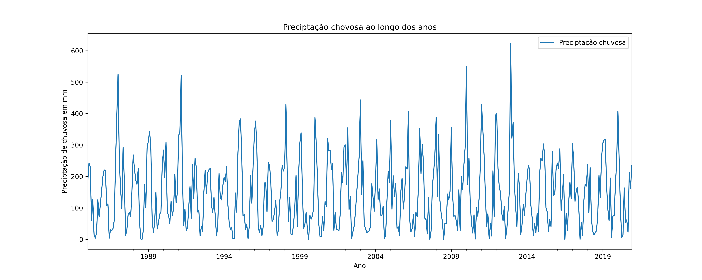
1.1 Média movel sete dias serie temporal.
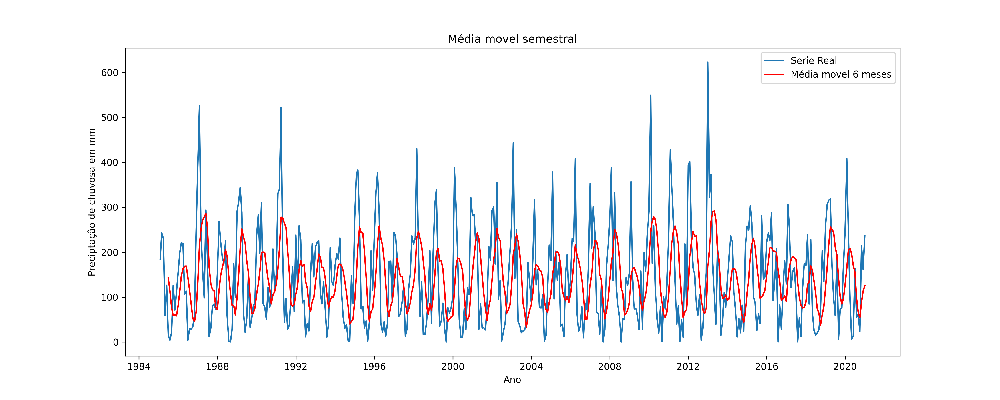
1.2 Série tempora decomposta.
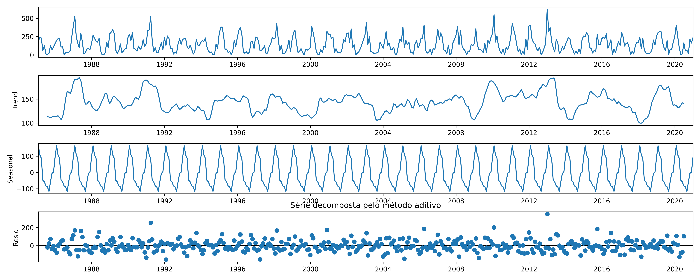

2. Transformação raíz cubica sobre a série
2.1 Série transformada
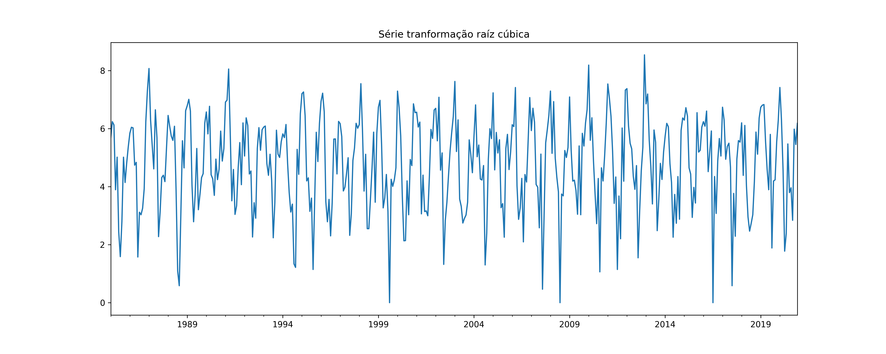
2.2  Quantile-Quantile Plot -Série raíz cúbica
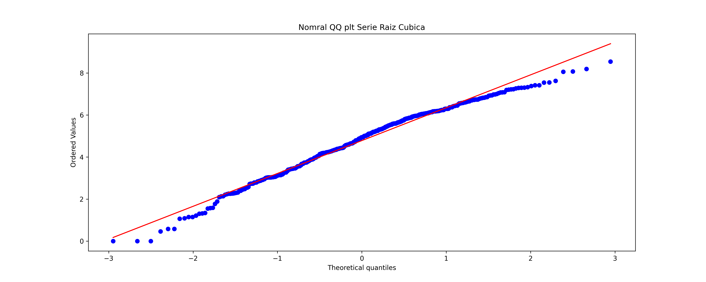 
2.3  Autocorrelation Function -Série raíz cúbica
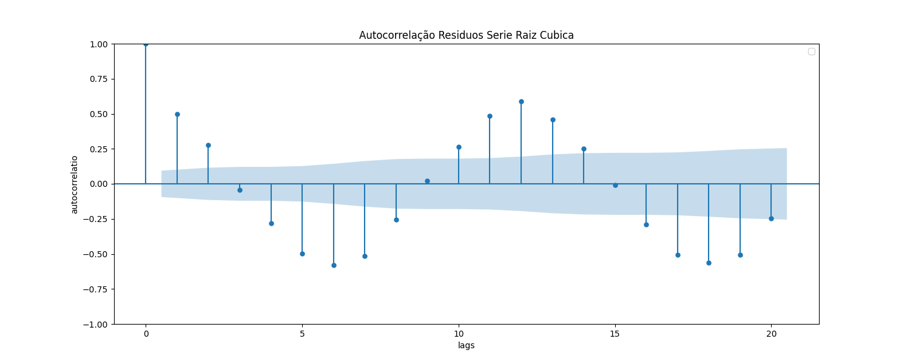 
2.4 Partial Autocorrelation Function-Série raíz cúbica
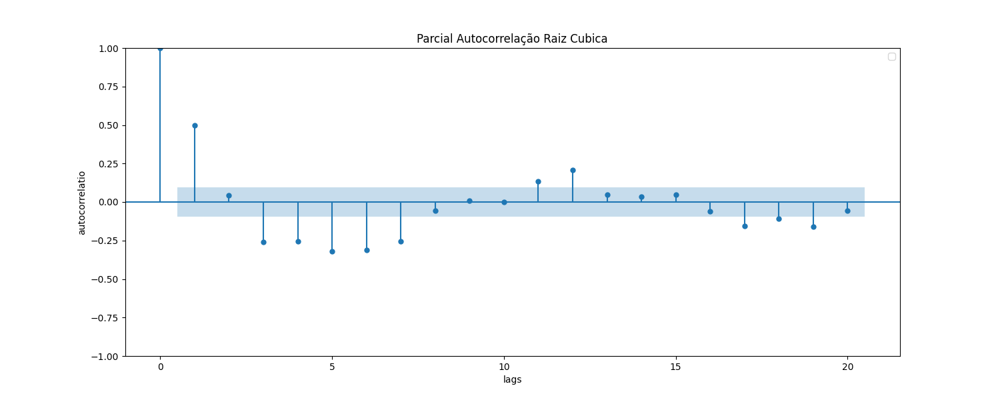

3. Aplicação Modelo Autoregressivo
3.1 Estudo dos resíduos
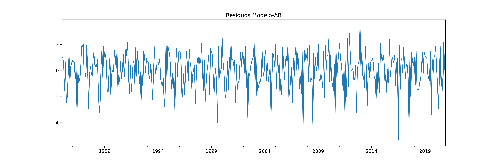

3.2 Quantile-Quantile Plot-Rediduo -Modelo AR
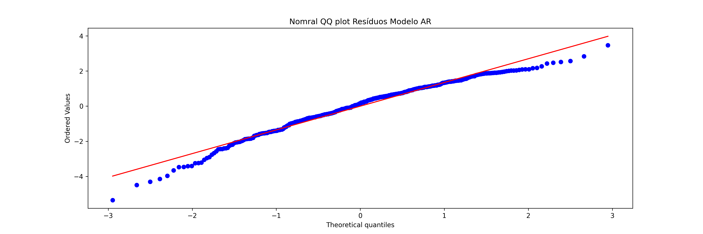 

3.3 Autocorrelation Function-Resíduos -Modelo AR.
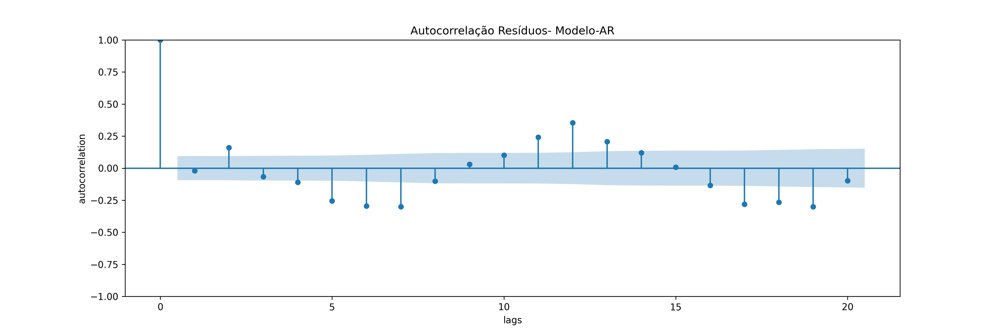

3.4. Partial Autocorrelation Function -Resíduos- -Modelo AR.
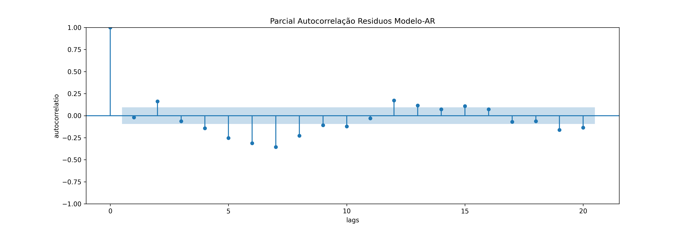

4 Resultados

4.1 Série e resíduos
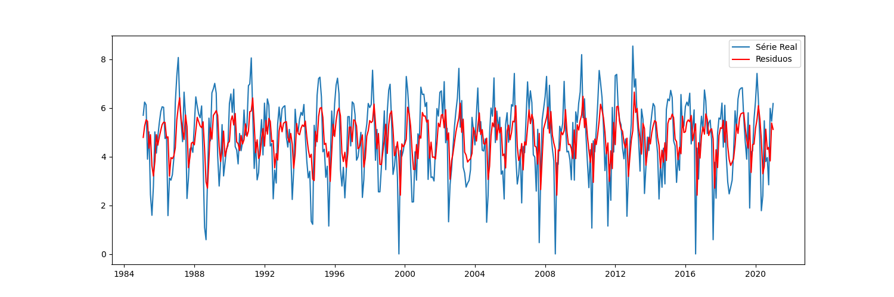

4.1 Previsão.
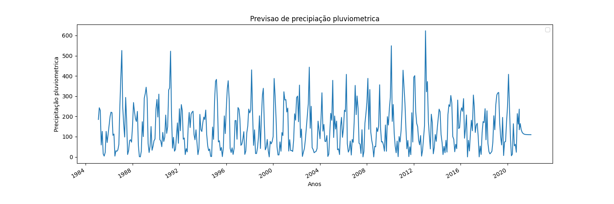